# Mise en place d’un outil de gestion de l’activité (fiche de cotation)

V0.4 – 28/09/2021

## Objectifs

Mise en place d’un outil numérique permettant :

- la saisie des fiches en temps réel sur tablettes
- l'analyse des données récoltées
- le partage d'information avec l’ensemble des intervenants et des parents

## Périmètre

### La méthode ABA

L’ABA est un traitement comportemental reposant sur les sciences du comportement. Ce traitement dispose de techniques permettant de faciliter l’apprentissage de nouveaux comportements, en analysant la tâche, en la divisant en sous-objectifs, en apportant des aides de façon précise puis en programmant leur estompage. Les efforts de l’enfant sont motivés grâce à un travail important sur la motivation et la recherche de nouveaux centres d’intérêt. Ce traitement permet de développer tout apprentissage : habileté sociale, propreté, autonomie, jeux autonomes, demandes…

Ce type d’enseignement, plus ou moins structuré et dépourvu de stimuli parasites, est individualisé en fonction du niveau d’attention de l’enfant, de sa vitesse d’apprentissage, de sa capacité à généraliser les nouveaux apprentissages.

**L’apprentissage de compétences** :

En se basant sur des méthodes d’apprentissage éducatives, les enfants apprennent des gestes simples qui, une fois combinés, aboutissent à des comportements plus complexes.

Les comportements d’un enfant autiste peuvent être bloquants pour l’acquisition de certaines compétences, notamment au niveau de la communication et des relations sociales. L’objectif est donc d’apprendre presque naturellement à l’enfant autiste les comportements à adopter pour progresser dans sa communication avec l’autre.

Pour déterminer des objectifs, on part du besoin de l’entourage et on cible les comportements qui permettront à l’enfant d’être moins manipulé et mieux intégré (pour exemples : hygiène, dire bonjour, jouer avec un camarade, s'assoir dans un groupe, etc.). C’est donc l’environnement qui détermine les priorités.

L’acquisition de compétences est enseignée dans différents domaines :

- le langage ;
- l’intégration sociale ;
- l’attention ;
- les capacités motrices ;
- les jeux et activités ;
- l’autonomie, etc.  

Source [https://www.autismeinfoservice.fr](https://www.autismeinfoservice.fr/accompagner/travailler-enfants-autistes/aba#:~:text=L'ABA%20est%20un%20traitement,puis%20en%20programmant%20leur%20estompage.)

### Les activités

- Evaluation de chaque enfant par un psychologue (VB-MAPP, PEP-R…)
- Elaboration d’un P.E.I (Programme Educatif Individuel) qui fixe les objectifs d’apprentissage pour une année : coopération, imitation, communication, langage, interactions sociales, autonomie au quotidien…
- Mise en œuvre du P.E.I : chaque enfant vient à l’association de 2 à 5 demi-journées par semaine (9h – 12h ou 14h-17h), où il est pris en charge par 1 ou 2 intervenants, supervisés par les psychologues
- Evaluation quotidienne des acquis et difficultés de l’enfant
- Réunion de synthèse mensuelle parents/psychologue
- Implication des parents dans la mise en œuvre du P.E.I à domicile
- Participation du psychologue aux équipes éducatives à l’école, relation avec l’enseignant s’il le souhaite
- Guidances parentales

### L’outil d’évaluation VB-MAPP

Le VB-MAPP (Verbal Behavior – Milestones Assessment and Placement Program) est un outil d’évaluation récent (2008), développé par Mark L. Sundberg, un des créateurs de l’ABLLS et tout comme l’ABLLS, il peut servir à la fois d’outil d’évaluation et de curriculum. Dans la lignée de l’ABLLS il est basé sur l’approche fonctionnelle des comportements verbaux proposée par Skinner. Il est nécessaire de bien connaitre cette approche avant d’utiliser cet outil, sinon les résultats seront incohérents.

Cet outil est divisé en plusieurs parties :

- Evaluation des compétences :  
  Dans cette partie, on évalue les compétences des enfants sur différents domaines comme : demandes – jeu – imitation – performances visuelles – vocabulaire réceptif par fonction, classe, caractéristique.
- Evaluation des barrières des apprentissages :  
  Ici, on évalue ce qui freine ou empêche certains apprentissages. Par exemple : problèmes de généralisation – discriminations conditionnelles déficitaires – dépendance aux renforçateurs etc. En tout, 24 barrières sont testées.
- Evaluation des possibilités de transition vers le milieu ordinaire :  
  18 domaines sont évalués dans cette partie du VB-MAPP comme : adaptation au changement – suivi des routines de classe – vitesse d’acquisition des compétences – travail en groupe.
- Analyse fine des compétences :  
  Ici, les compétences testées dans la première partie de l’évaluation sont subdivisées en de nombreuses petites étapes et permettent notamment de suivre finement les avancées des enfants et de décider des programmes éducatifs à mettre en place.

## Spécifications

### Les données

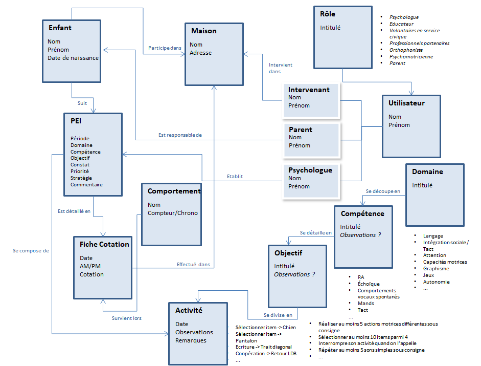

### Les traitements

#### Schéma général

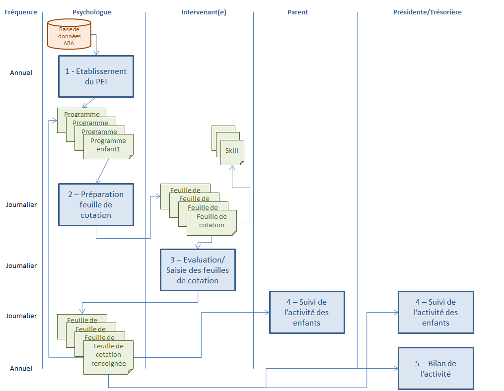

#### Paramétrage

- Gestion des données ABA
  - Saisir l’exhaustivité des données des activités
    - Domaines
    - Compétence
    - Objectif
    - Activité
- Gestion des intervenants
  - Saisir la liste des intervenants *Avec code d’accès à l’application* (Contenu des informations restant à détailler)
- Gestion des enfants et des parents
  - Saisie des informations de chaque enfant
    - Nom
    - Prénom
    - Date de naissance
    - Date inscription P’tit Dom
  - Saisie des informations de chaque parent

Avec code d’accès à l’application

- Gestion des membres du bureau
- Saisie des informations pour chaque membre *Avec code d’accès à l’application*
  - Nom
  - Prénom
  - Rôle

##### Etablissement d’un programme

- Qui : Psychologue
- Exemple :  
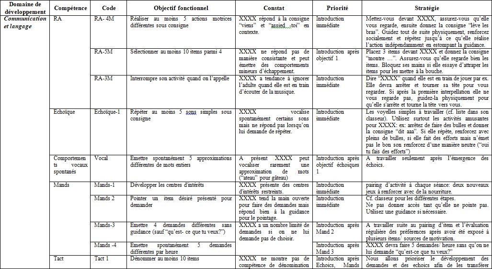
- Modalités  
  Sélection des items par domaine, compétence et objectif  
  Saisie libre du constat, de la priorité et de la stratégie (individualisée par enfant)

##### Préparation fiche de cotation

- Qui : Psychologue
- Exemple :
  - Fiche de cotation  
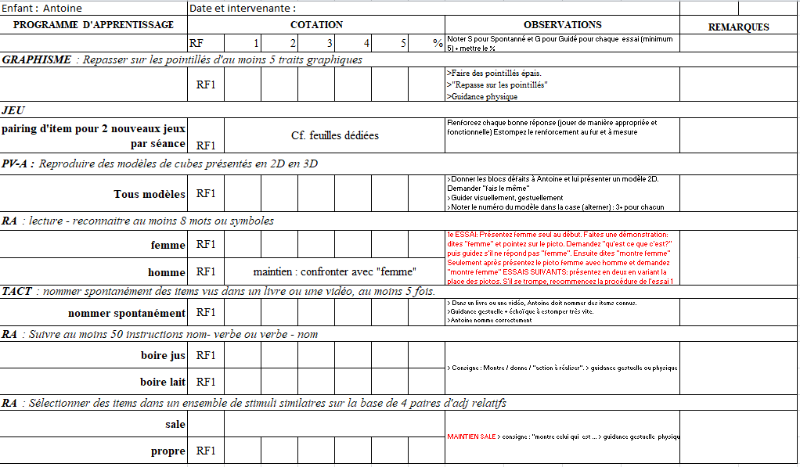
  - Skills  
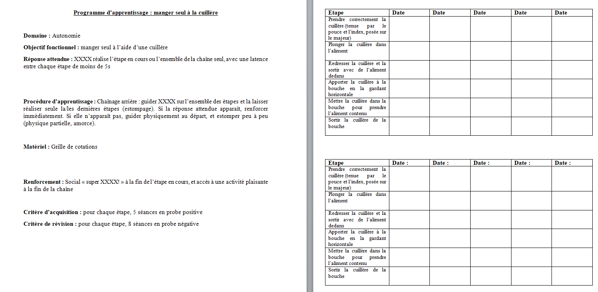
  - Modalités  
Sélection des objectifs à tester dans le PEI de l’enfant  
Ajouter les activités permettant d’évaluer les objectifs  
Nota : garder la possibilité de reprogrammer une activité déjà acquise

##### Evaluation / Saisie fiche de cotation

- Qui : Intervenant
- Modalité
  - Une fiche « Skill » est rattachée à une activité de la fiche de cotation  
  Sur une fiche Skill de type comportement, il faut pouvoir gérer :
    - Un chrono
    - Un compteur (nombre de fois)
  - Une activité est considérée comme acquise lorsque le résultat obtenu en fin de journée est de 80%

##### Suivi de l’activité des enfants

- Qui : Parent, Intervenant, psychologue, membre du bureau
- Modalité
  - Visualiser le programme de l’enfant (affichant ce qui est acquis, en cours ou à faire)
    - Acquis = validé suite à activité
    - Non acquis/En cours = pris en compte sur une feuille de cotation mais pas encore acquis
    - A faire = Non encore activé sur une séance
  - Visualiser les fiches de cotation par journée

##### Bilan d’activité

- Qui : Présidente/Trésorière
- Modalité
  - Bilan d’activité de l’enfant
  - Bilan d’activité de la structure  
  (à définir en détail)

### Maquettes

#### Page d’accueil

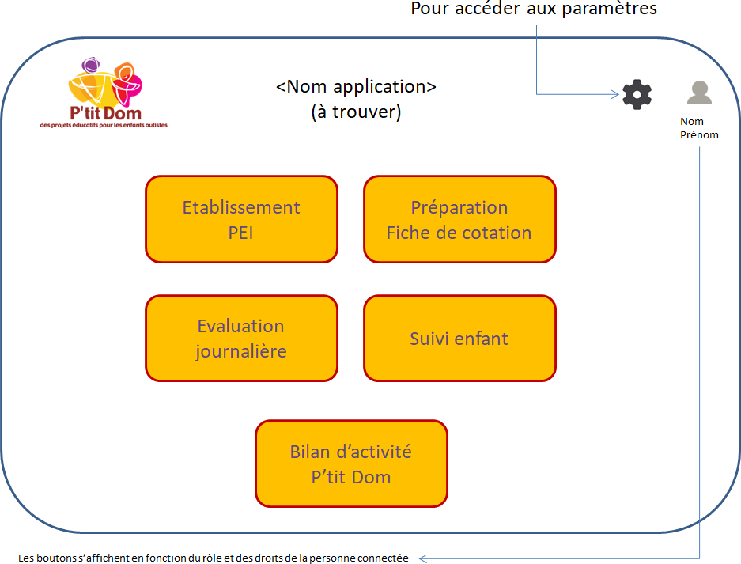

#### Paramètres

##### Page principale

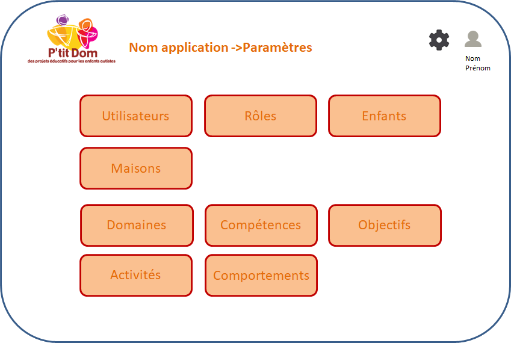

##### Paramétrage général

Il faut prévoir d’ajouter le protocole associé au trouble du comportement…   Modalités à préciser

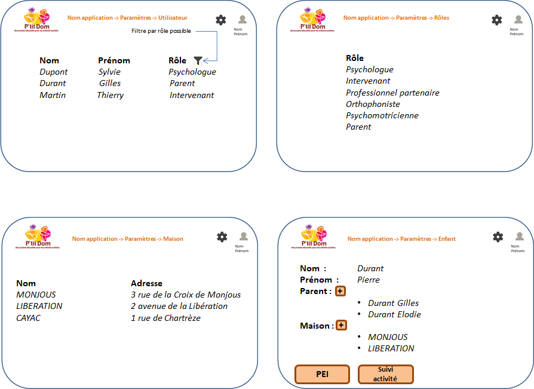

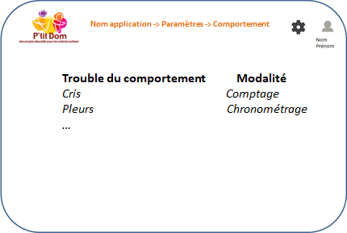

##### Paramétrage évaluation

#### Construction du PEI

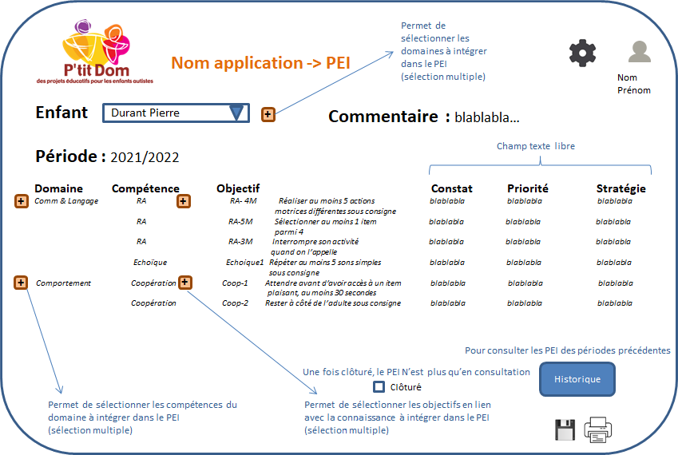

#### Etablissement de la fiche de cotation

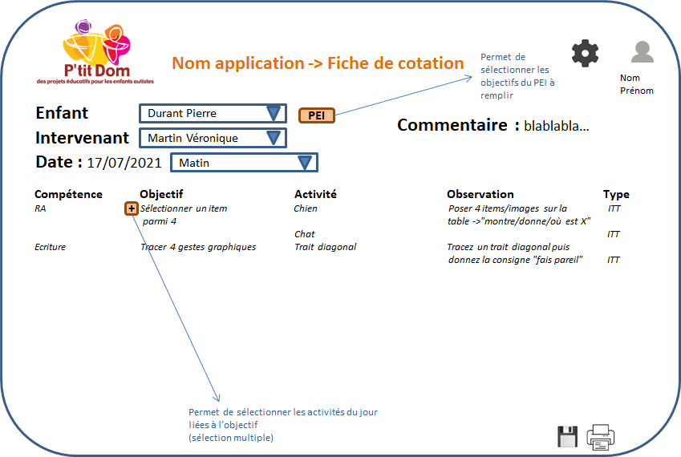

#### Saisie de l’évaluation journalière

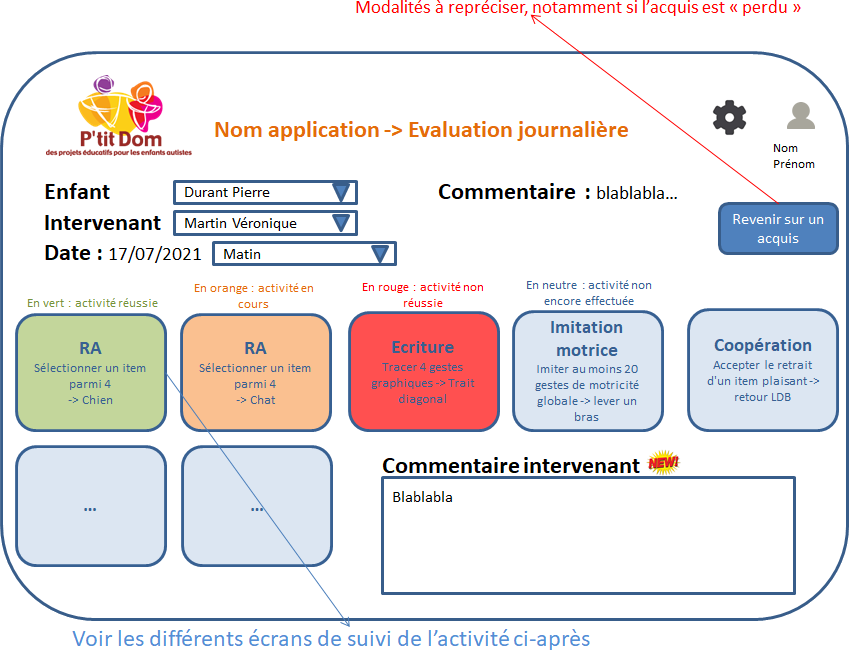

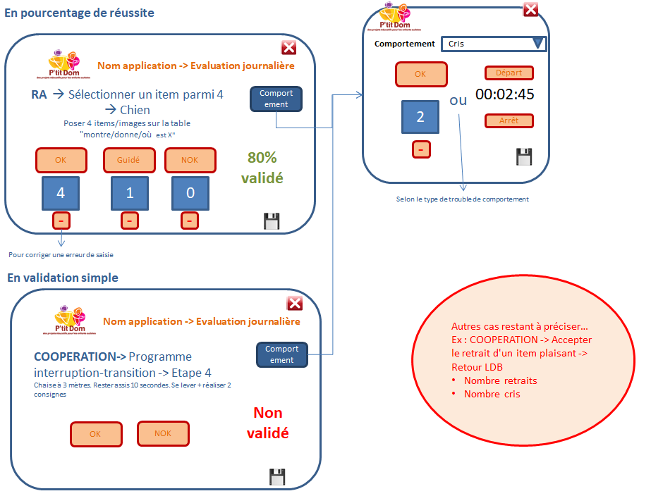

#### Suivi d’activité de l’enfant

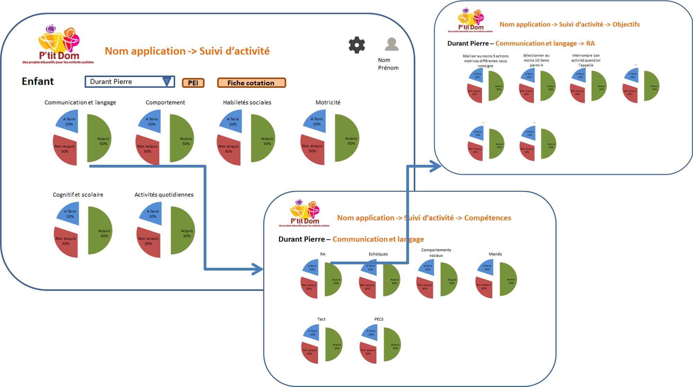

#### Bilan d’activité P’tit Dom

(reste à spécifier)

## Annexe

### Vocabulaire

<https://www.ba-eservice.info/vocabulaire>  

- A
  - ***A-B-C:*** antecedent--> behavior --> conséquence , en français antécédent--> comportement--> conséquence.
  - ***âge chronologique:*** se réfère au nombre d'années et journées écoulées depuis la naissance.
  - ***âge développemental:*** se réfère à un âge équivalent évalué lors d'une passation de test par rapport à un développement moyen. Cet âge peut prendre en compte la motricité fine, la motricité globale, le développement cognitif, le développement perceptif, les activités de la vie quotidienne, le jeux, le langage et les aspects socio-affectifs.
  - ***agent punisseur:*** stimulus diminuant la fréquence d'apparition d'un comportement.
  - ***agent renforçateur:*** stimulus augmentant la fréquence d'un comportement.
  - ***alternatif (comportement):*** comportement de topographie différente constituant une alternative fonctionnelle au comportement en place.
  - ***analyse fonctionnelle descriptive:*** détermination des corrélations entre le contexte, les comportements et les conséquences.
  - ***analyse fonctionnelle expérimentale:*** comparaison des taux de réponses d'un individu en manipulant une ou plusieurs variables.
  - ***antécédent:*** évènement qui apparait juste avant l'occurrence du comportement cible. Ceci inclut les circonstances générales de l'environnement et des événements déclencheurs spécifiques.
  - ***apétitif (stimulus):*** renforçateur pour la personne qui le reçoit.
  - ***apprentissage:*** ensemble de mécanismes visant à transmettre à un apprenant un savoir, savoir-faire ou des connaissances.
  - ***apprentissage incident:*** apprentissage se produisant en l'absence d'instructions ou de conséquences, en contraste avec l'apprentissage intentionnel.
  - ***apprentissage sans erreur:*** acquisition de compétences au moyen d'instructions visant à éviter les erreurs. Des stimuli artificiels comme les guidances sont arrangés afin d'évoquer immédiatement la réponse, puis progressivement le contrôle de la réponse est placé vers les stimuli naturels.
  - ***approche:*** cadre théorique visant à décrire et expliquer un phénomène. L'approche diffère de la méthode par le fait que ce n'est pas une recette à appliquer mais un ensemble de connaissances.
  - ***attention:*** comportement de focalisation d'un sens sur les variations d'un stimulus.
  - ***autostimulation (renforcement automatique):*** le renforçateur est lié à la réponse de manière automatique. La réponse est renforcée par le comportement directement sans intermédiaire.
  - ***aversif (stimulus):*** punisseur pour la personne qui le reçoit.
- B
  - ***behaviorism:*** courant psychologique, initié par Thorndike puis fondé par J.B Watson, dans lequel le principe est que le comportement fluctue et s’adapte selon les modifications de son environnement. C’est une conception de la psychologie comme science du comportement observable.
  - ***bouffée d'extinction:*** augmentation de la fréquence du comportement quand l'accès au renforcement est refusé pendant l'extinction.
- C
  - ***chainage:*** procédure d’apprentissage d’un comportement complexe que l’on divise en plusieurs séquences simples prédéfinies successives.
  - ***chainage avant:*** procédure de chainage dans laquelle la première séquence de la chaine est guidée et renforcée immédiatement. On guide le reste du chainage, sans renforcer. Une fois que la première séquence est acquise, on fait apprendre la deuxième séquence et ainsi de suite jusqu'à l'acquisition complète du comportement.
  - ***chainage arrière:*** procédure de chainage dans laquelle on effectue toute la chaine de comportement en estompant la guidance de la dernière séquence seulement, puis dès que celle-ci est acquise, de l'avant dernière et ainsi de suite jusqu'à l'acquisition complète du comportement. Le renforcement intervient toujours à la fin de la chaine.
  - ***CMO (conditioned motivating operation):*** une motivating operation dont l'effet dépend des apprentissages passés.
  - ***comportement:*** tout ce que nous faisons, disons... les comportements sont appris et maintenus par nos cinq sens en interaction quotidienne avec notre environnement. Ils ont tous une fonction.
  - ***comportement cible:*** comportement sur lequel on cherche à intervenir.
  - ***comportement opérant:*** comportement qui apparait et se maintient dans le temps en fonction des contingences.
  - ***comportement pivot:*** comportement, qui une fois acquis, permet l'acquisition de nouveaux comportements sans entrainement spécifique.
  - ***comportement réflexe:*** relation stimulus-réponse où le stimulus antécédent provoque le comportement répondant.
  - ***comportement superstitieux:*** comportement augmentant en fréquence alors qu'il n'est suivi d'aucune conséquence.
  - ***condition:*** ensemble des circonstances extérieures.
  - ***condition contrôle:*** situation sans modification ou manipulation.
  - ***conditionnement opérant:*** façon dont un comportement opère sur son environnement. Augmentation ou diminution du comportement opérant selon la conséquence.
  - ***conditionnement répondant:*** apprentissage associatif entre un stimulus et une réponse. Un stimulus neutre associé à un stimulus inconditionné provoque lui-même la réponse.
  - ***consécutif:*** se dit de plusieurs choses qui se suivent sans interruption dans le temps.
  - ***conséquence:*** stimulus de l'environnement qui suit le comportement et qui détermine si le comportement se reproduira ou non.
  - ***contingence:*** fait référence aux relations entre le comportement, d'une part et ses antécédents et ses conséquences d'autre part dans l'environnement. Les deux événements dépendent l'un de l'autre : le comportement dépend de l'antécédent et la conséquence dépend du comportement.
  - ***corrélation:*** relation existante entre deux notions liées par une dépendance nécessaire.
  - ***coût (de la réponse):*** effort nécessaire à l'émission d'un comportement.
- D
  - ***data***: fait, notion ou instruction représenté de diverses manières convenant à une observation ou à un traitement.
  - ***déprivation:*** manque de quelque chose de spécifique.
  - ***désensibilisation:*** procédure visant à diminuer l'effet aversif d'un stimulus sur un organisme.
  - ***déterminisme:*** système de philosophie selon lequel les événements sont déterminés par des antécédents, suivant la loi de cause à effet.
  - ***discret trial training (DTT):*** apprentissage par essais discrets : procédé d'enseignement par étapes simplifiées. Au lieu d'enseigner toute une compétence en une seule fois, la compétence est découpée en petites unitées et apprise en petites unités de maniére répétée dans un environnement contrôlé.
  - ***discrimination:*** action de séparer, de distinguer 2 ou plusieurs êtres ou choses à partir de certains critères ou caractères distinctifs.
  - ***donnée:*** voir data.
  - ***durée:*** période de temps mesurable dans un espace fini.
- E
  - ***échappement:*** comportement visant à échapper (quitter, fuir...) un environnement et/ou une situation.
  - ***echoïc***: opérant verbal précédé d'un stimulus verbal où le comportement verbal est de répéter exactement le stimulus précédent. Le renforcement est non spécifique et se fait par la médiation sociale (ex: imitation verbale).
  - ***écholalie:*** répétition systématique de tout ou d'une partie d'une production verbale.
  - ***économie de jetons:*** système recommandé pour modifier et enseigner des comportements où l'accumulation des jetons obtenus permet d'accéder à des renforçateurs.
  - ***empirisme:*** théorie philosophique selon laquelle l'expérience est à l'origine des connaissances que nous avons. Façon de procéder se reposant exclusivement sur les données et excluant les systèmes "a priori".
  - ***environnement:*** contexte où se produisent les comportements. Il prend en compte tous les événements et les stimuli qui affectent un comportement.
  - ***essai discret:*** antécédent --> comportement --> conséquence / consigne --> réponse --> renforcement.
  - ***essai massé:*** plusieurs essais discrets consécutifs d'un même comportement.
  - ***essai mixé:*** plusieurs essais discrets de différents comportements.
  - ***establishing operation (EO):*** opération motivationnelle qui établit (augmente) l'efficacité d'un stimulus, objet, ou événement en tant que renforçateur ou punisseur (ex: une déprivation de la nourriture établit la nourriture comme renforçateur efficace).
  - ***estompage (de guidance):*** procédure qui consiste à amener le comportement cible à être contrôlé par le stimulus antécédent en retirant graduellement les guidances et les incitations.
  - ***évaluation des préférences:*** technique utilisée pour déterminer les stimuli potentiellement renforçant.
  - ***expressif:*** réponse verbale de l'auditeur à un stimulus verbal.
  - ***extinction***: procédure consistant à l'arrêt d'un renforcement renforçant l'apparition d'un comportement. L'effet principal est une diminution de la fréquence d'un comportement jusqu'à sa disparition.
  - ***extinction burst:*** augmentation de la fréquence du comportement quand l'accès au renforcement est refusé pendant l'extinction.
- F
  - ***façonnement***: procédure de guidances pour un comportement complexe consistant à renforcer les approximations jusqu'à l'obtention totale du comportement cible.
  - ***functional behavior assessment (FBA):*** ensemble de stratégies utilisées pour déterminer la fonction sous-jacente ou le but d'un comportement, de sorte qu'un plan d'intervention efficace puisse être développé. Il consiste à décrire le comportement, à identifier les antécédents et les conséquences contrôlant le comportement, à développer une hypothèse et à tester cette hypothèse. La collecte de données est une partie importante de ce processus.
  - ***feedback:*** information transmise à la personne suite à une performance particulière. Ces commentaires peuvent fonctionner comme un agent renforçateur ou un agent punisseur.
  - ***fonction du comportement:*** ce pourquoi le comportement est émis.
  - ***fréquence:*** nombre de fois où un comportement apparait dans un temps donné.
- G
``***généralisation:*** occurrence du comportement en présence de nouveaux stimuli.
  - ***graphique***: représentation visuelle des variations d'une grandeur mesurable.
  - ***guidance:*** stimulus sur-ajouté permettant la hausse de la probabilité de réalisation du comportement lorsque les antécédents habituels ne suffisent pas pour engendrer la réponse.
- H
  - ***habituation:*** forme d'apprentissage consistant en la diminution progressive de l'intensité ou de la fréquence d'apparition d'une réponse suite à la présentation répétée ou prolongée du stimulus l'ayant déclenchée.
  - ***hypothèse:*** supposition à partir de laquelle se construit un raisonnement, elle vise à être confirmée ou infirmée par une démarche scientifique.
- I
  - ***imitation:*** reproduction d'un comportement à l'identique, à partir d'un modèle.
  - ***intermittent:*** discontinu, irrégulier. Un programme de renforcement intermittent consiste à renforcer un comportement de manière occasionnelle.
  - ***intervalle:*** bloc entre deux valeurs d'une même grandeur.
  - ***item:*** élément particulier d'un ensemble.
  - ***intensive trial training (ITT):*** apprentissage de manière systématique et intensive de compétences par l'utilisation d'un renforçateur positif pour un comportement qui n'a aucun lien avec ce renforçateur. Parmi les procédures utilisées, l'apprentissage sans erreurs, les essais massés, les essais mixés, le pairing, le renforcement immédiat. Le travail sur table permet un meilleur contrôle instructionnel, mais l'ITT peut être fait partout.
  - ***intraverbal:*** comportement verbal contrôlé par des stimuli verbaux qui amènent à obtenir des renforçateurs non spécifiques. Il n'y a pas forcément de similarité formelle entre le stimulus discriminatif et la réponse; et il n'y pas de correspondance point à point entre le stimulus discriminatif et la réponse.
- L
  - ***langage:*** capacité et moyen de s’exprimer et de communiquer (peut être verbal, par signe,...).
  - ***latence:*** durée entre un stimulus et une réponse.
  - ***ligne de base:*** mesure de l'état initial d'un comportement cible en situation naturelle, sans guidance ni traitement, permettant de déterminer la pertinence de la mise en place d'un programme d'apprentissage.
  - ***loi de l'effet:*** loi de l’apprentissage montrant qu’un comportement suivi d’une conséquence agréable aura tendance à augmenter (Thorndike).
- M
  - ***maintien:*** durant un apprentissage, phase où la réponse apprise est travaillée pour permettre sa persistance dans le temps et permettre son apparition systématique lors de la présence des contingences de l'apprentissage.
  - ***mand:*** premier opérant verbal acquis par le jeune enfant, dans lequel la réponse est renforcée par une conséquence caractéristique et est donc sous le contrôle fonctionnel des conditions pertinentes de la déprivation et de la stimulation aversive.
  - ***matching to sample task***: tâche d’association, lors de laquelle l’apprenant doit reconnaître le même stimulus que celui qui lui a été présenté (en même temps ou de manière différée).
  - ***mesure:*** détermination d'une grandeur particulière grâce à un étalon ou une unité.
  - ***modeling:*** production d'un modèle afin de susciter une réponse d'imitation pour les apprentissages de comportements simples.
  - ***motivating operation (MO):*** ensemble d'évènements, de stimuli ou de conditions qui établit la valeur d'un stimulus en tant que renforçateur ou punisseur et donc qui modifie la fréquence d'une réponse.
  - ***motivation:*** ensemble des facteurs augmentant la probabilité de réponse en présence du stimulus discriminatif.
- N
  - ***natural environnement training (NET):*** entrainement en environnement naturel; situation d’apprentissage, non-structurée,  qui vise à créer des opportunités d’apprentissage en suivant les choix et la motivation de l’enfant.
- O
``***objectif (comportement cible):*** description précise, complète et objective d'un ensemble de comportements ou de performances que la personne doit atteindre afin d'être reconnue compétente.
  - ***observation:*** constatation des phénomènes, sans volonté de les modifier. Se distingue, par ce fait, de la méthode expérimentale.
  - ***overcorrection:*** (ou surcorrection) procédure de punition positive basée sur l'effort dans le but de la réduction de la fréquence d'un comportement cible, qui consiste à faire corriger un comportement cible inadapté en réparant les dommages causés et à produire un comportement adapté contingent au comportement cible.
- P
  - ***pairing:*** processus d'association entre deux stimuli ou deux événements, où un stimulus prend la fonction de l'autre.
  - ***parcimonie (principe de):*** exige que toutes les explications simples et logiques pour les phénomènes étudiés soient exclues expérimentalement avant de considérer des explications plus complexes ou abstraites.
  - ***phylogénèse:*** histoire évolutive d’une espèce ou d’un groupe d’espèces apparentées.
  - ***pic d'extinction:*** point culminant (fréquence, intensité, etc...) de l'apparition d'un comportement cible lors des premiers temps de la mise en place d'une procédure d'extinction, avant sa diminution. Ce comportement cible étant jusque-là suivi d'un renforçateur.
  - ***placebo:*** stimulus neutre entrainant cependant une conséquence attendue par la personne.
  - ***plan à cas unique:*** méthode expérimentale portant sur un sujet unique (étude de cas).
  - ***plan à changement de critère:*** modèle expérimental dans lequel une phase initiale (ligne de base) est suivie par une série de phases de traitements constitués de critères successifs et de changements graduels de renforcement ou de punition.
  - ***plan à ligne de base multiple:*** modèle expérimental qui commence par la mesure de deux ou plusieurs comportements en condition de ligne de base, suivi de l'application d'un traitement à l'un des comportements de la ligne de base. Le traitement est appliqué de manière séquentielle aux autres comportements dès qu'une modification est observée dans ce comportement.
  - ***pourcentage:*** manière d'exprimer un rapport au moyen d'une fraction de cent.
  - ***Premack (principe de ):*** principe selon lequel il est possible d'accroître un comportement à basse probabilité d'apparition en utilisant comme renforçateur un comportement à haute probabilité d'apparition.
  - ***priorité:*** comportement travaillé pour atteindre l'objectif fixé, les priorités évoluent en fonction de l'avancée des programmes pour atteindre un objectif donné.
  - ***proactif:*** procédure qui a des conséquences sur une période postérieure/ultérieure à elle-même.
  - ***procédure:*** ensemble de règles que l’on applique dans une situation déterminée de manière spécifique.
  - ***procédure de correction d'erreur:*** technique qui vise à installer un comportement sous le contrôle des bons stimuli. La réponse erronée de l'apprenant est corrigée puis guidée afin d'encourager la spontanéité des réponses.
  - ***probe:*** brève phase dans une expérience d'analyse du comportement conçue pour tester l'effet d'une intervention donnée.
  - ***prompt:*** voir guidance.
  - ***punition:*** procédure par laquelle un comportement devient moins fréquent.
  - ***punition négative:*** procédure par laquelle un comportement devient moins fréquent suite au retrait d'un stimulus.
  - ***punition positive:*** procédure par laquelle un comportement devient moins fréquent suite à l'ajout d'un stimulus.
- R
  - ***ratio fixe:*** calendrier où le nombre de réponses est constant d'un renforcement à l'autre.
  - ***ratio scale:*** échelle de mesure qui détermine la quantité, l'ordre, l'égalité des intervalles et l'égalité des ratios entre les valeurs.
  - ***ratio variable:*** calendrier où le nombre de réponses varie pour l'obtention d'un renforcement. Il est généralement identifié en terme de ratio moyen.
  - ***rebond (effet):*** lors du pic d'extinction, le comportement se modifie et laisse apparaître d'autres comportements ayant la même fonction que le comportement initial (variabilité comportementale).
  - ***réceptif:*** réponse motrice de l'auditeur à un stimulus verbal.
  - ***recherche d'attention:*** fonction d'un comportement pour obtenir quelques formes d'attention sociale ou pour obtenir une réaction des autres personnes.
  - ***réflexe:*** relation entre un stimulus inconditionné et le déclenchement d'une réponse inconditionnée.
  - ***réflexivité:*** en l'absence d'entrainement et de renforcement, l'apprenant sélectionne un stimulus de comparaison qui est le même que l'échantillon du premier stimulus, A=A.
  - ***relation d'équivalence:*** relation entre les stimuli non entrainée et non renforcée qui suivent aux réponses renforcées à certaines relations entre les stimuli. La réflexivité, la symétrie et la transitivité sont nécessaires pour avoir une relation d'équivalence.
  - ***renforcement:*** procédure par laquelle un comportement devient plus fréquent.
  - ***renforcement négatif:*** procédure par laquelle un comportement devient plus fréquent suite au retrait d'un stimulus.
  - ***renforcement positif:*** procédure par laquelle un comportement devient plus fréquent suite à l'ajout d'un stimulus.
  - ***renforcement différentiel:*** procédure par laquelle le ou les comportements adaptés sont renforcés et le ou les comportements inadaptés sont mis en extinction.
  - ***réplication:*** répétition des conditions dans une expérience.
  - ***réponse:*** comportement émis suite à un stimulus.
  - ***résistance à l'extinction:*** persévérance d'un comportement placé en extinction. Il se mesure en quantité de temps et en nombre de réponses avant que le comportement ne s'éteigne.
  - ***résistance au changement:*** persévérance d'un comportement face au changement, à l'imprévu. Cela peut survenir quand les routines sont importantes et qu'il y a peu de variations comportementales.
  - ***rétroactif:*** procédure qui a des conséquences sur une période antérieure à elle-même.
  - ***rule governed behavior:*** le comportement est contrôlé par des règles. Ces règles sont des déclarations qui nous prédisent que dans certaines situations, si nous effectuons un certain comportement, une certaine réponse s'ensuivra.
- S
  - ***satiété:*** le pouvoir renforçant d'un stimulus est réduit si celui-ci était accessible avant même son utilisation en agent renforçateur.
  - ***science:*** ensemble des connaissances fondées sur la preuve, vérifiées et vérifiables. La science évolue grâce à la recherche et l'expérience. La science s'oppose dans sa définition à l'opinion et l'intuition.
  - ***self control:*** comportement présentant des avantages à long terme mais pour lesquels il n'y a pas de renforcement immédiat visible.
  - ***self management:*** procédure dans laquelle les individus changent certains aspects de leur propre comportement. Un ou plusieurs des 4 composants principaux sont appliqués: auto-sélection des objectifs, suivi de son propre comportement, sélection des procédures et mise en œuvre des procédures.
  - ***session:*** période pendant laquelle l'organisme est sujet à des conditions expérimentales.
  - ***shaping:*** voir façonnement.
  - ***SIB (self injurious behavior):*** comportement d'automutilation où la personne s'engage dans des comportements agressifs envers elle-même.
  - ***spontanée:*** apparaissant sous le contrôle des stimuli naturels.
  - ***SSB (self stimulatory behavior):*** mouvement moteur répétitif ou mouvement répétitif avec des objets. Forme de comportement d'autostimulation impliquant un ou plusieurs sens.
  - ***stéréotypie:*** répétition motrice ou verbale involontaire sans but social.
  - ***stimulus:*** évènement pouvant déterminer une réponse en une réaction chez un organisme vivant.
  - ***stimulus conditionné:*** stimulus qui, ayant fait l'objet d'un apprentissage, est suivi d'un comportement spécifique.
  - ***stimulus contrôle:*** situation dans laquelle le taux, la latence, la durée ou l'amplitude d'un comportement sont modifiés par la présence ou l'absence d'un stimulus antécédent.
  - ***stimulus delta (SΔ):*** stimulus pour lequel, en présence d'un comportement donné, aucun renforcement n'a eu lieu.
  - ***stimulus discriminatif (SD)***: stimulus qui contrôle l'émission d'un comportement.
  - ***stimulus inconditionné:*** stimulus qui déclenche une réponse inconditionnelle, de manière réflexe sans qu'un apprentissage préalable n'ait été nécessaire.
  - ***stimulus-stimulus pairing:*** procédure d'association entre deux stimuli ou deux événements, où l'un est neutre et l'autre n'est pas neutre.
  - ***symétrie:*** si stimulus A=stimulus B et que stimulus B=stimulus A, il y a symétrie. Si un organisme répond de manière égale au stimulus A et au stimulus B et inversement.
- T
  - ***tâche:*** travail à faire dans un temps déterminé et sous certaines conditions.
  - ***tact:*** opérant verbal contrôlé par un stimulus non verbal de l'environnement où le comportement verbal est de nommer ou d'identifier des objets, des actions, des événements, des propriétés.
  - ***tangible ( renforçateur):*** se classe dans cette catégorie tout ce qui peut se manger, être manipulé, être regardé... ex: bonbon, jouet, jeux, image, jeton...
  - ***taux:*** rapport entre deux grandeurs, exprimé en valeur absolue (ex: pourcentage...).
  - ***textual (textuel):*** opérant verbal sous le contrôle d'un stimulus verbal, comme lire un texte. La réponse correspond point à point au stimulus contrôle.
  - ***time delay:*** c’est une procédure d’estompage de guidances dans l’apprentissage d’un comportement, d’une compétence. On estompe progressivement les guidances en insérant un délai entre la consigne donnée et l’apport de la guidance. Ce délai est progressivement augmenté.
  - ***time out:*** procédure de punition négative consistant à la mise à l'écart de toutes sources de renforcements suite à l'émission d'un comportement que l'on souhaite voir diminuer ou disparaitre.
  - ***topographie***: forme ou aspect physique d'un comportement observé (ex: crier, sauter, courir...).
  - ***totally task training:*** entrainement total à la tâche pour lequel on aide la personne, si elle en a besoin, sur chacune des étapes, jusqu'à ce que celle-ci réussisse seule, sans suivre d'ordre d'apprentissage. L'agent renforçateur est obtenu à la fin des étapes.
  - ***traitement:*** ensemble des procédures mises en place ou des procédures employées pour agir sur un comportement ou pour prendre en charge un sujet.
  - ***transcription:*** opérant verbal du comportement d'écriture sous le contrôle du stimulus verbal. La réponse possède une correspondance point à point avec le stimulus contrôle. Le renforçateur est non spécifique à la réponse.
  - ***transitivité:*** si le stimulus A=stimulus B et que le stimulus B=stimulus C, il y a transitivité (si un organisme répond de manière égale au stimulus A et au stimulus C.)
- V
  - ***variable:*** stimulus, donnée ou paramètre mesurable dans l'environnement.
  - ***variable dépendante:*** variable mesurée par l'expérimentateur sous l'influence de la variable indépendante.
  - ***variable indépendante:*** variable manipulée par l'expérimentateur ayant une influence sur la variable dépendante.
  - ***verbal (comportement):*** comportement renforcé par la médiation d’autrui.
  - ***video modeling:*** forme d’apprentissage par observation puis par imitation d’une vidéo de démonstration d’un comportement cible. La vidéo doit montrer la réalisation du comportement souhaité dans les mêmes conditions que celles dans lesquelles l’apprenant se trouve. Le but étant de reproduire ce comportement par imitation après le visionnage de la vidéo
